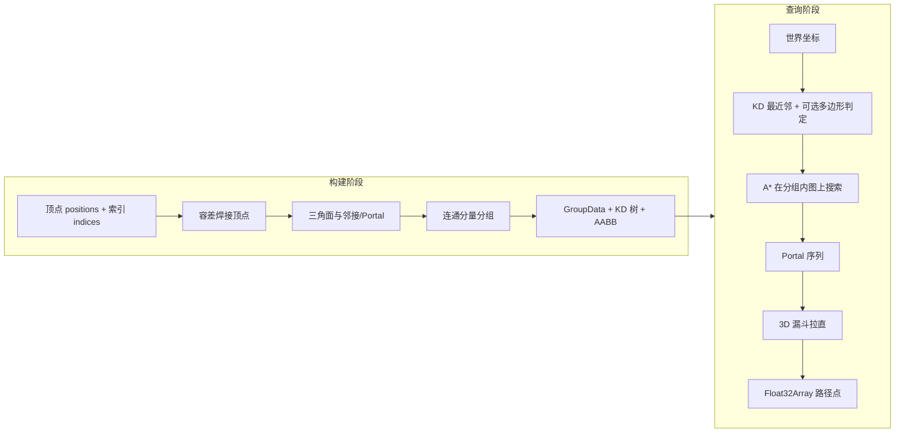

# pathfinding3d 寻路算法与实现概览

本文从**性能特征**、**底层模块实现**与**三维引擎兼容性**三方面，说明 `pathfinding3d` 中 NavMesh 式三维寻路的算法结构与工程取舍。实现语言为 **Rust**，通过 **WebAssembly** 暴露给 JavaScript/TypeScript。

---

## 1. 整体管线

库采用经典的 **导航网格（NavMesh）** 工作流：将可走区域表示为三角面片及其邻接图，在图上做 **A\*** 搜索得到多边形序列，再用 **漏斗算法（String Pulling / Funnel）** 把多边形通道拉直为空间折线。

同一 **Zone** 内可能包含多个 **Group**（互不相连的三角面子图）；`get_group` 决定点落在哪一组，`find_path` 仅在给定 `group_id` 内寻路。

---

## 2. 算法性能：为何快、快在哪里

### 2.1 执行环境与语言层

- **Rust + WASM**：热点路径（网格构建、空间查询、A\*、漏斗）在原生机器码或 WASM 中执行，避免纯 JavaScript 解释执行与频繁装箱的开销。项目 README 中与 `three-pathfinding-3d` 的对比属于**同量级场景下的经验性描述**；具体倍数随网格规模、图密度与硬件变化，应以实际基准测试为准。
- **数值类型**：内部大量使用 `f64`（`glam::DVec3`）做几何与搜索，与 JS 侧 `number` 精度衔接自然；输出写入 `Float32Array` 时再做 `f32` 截断，减小返回路径的内存与带宽。

### 2.2 内存与垃圾回收

- **预分配与复用**：每个分组预先分配 `AstarScratch`（开放表、closed、`g`/`h`、父指针、`touched` 用于增量清空）与 `PathScratch`（Portal 缓冲、路径点、`flat_points`）。单次查询主要在这些缓冲上读写，避免每次 `find_path` 在堆上大量分配小对象。
- **A\* 的 `reset`**：通过 `touched` 只恢复本次搜索访问过的节点，在图较大但搜索范围局部时，比整表 `memset` 更省。
- **启发式缓存**：`h_score` + `h_seen` 对每个节点到终点的欧氏距离只算一次，重复入堆时复用。

### 2.3 查询复杂度（定性）

| 环节 | 典型结构 | 说明 |
|------|----------|------|
| 最近三角形 / 分组 | 三维 KD 树 + AABB 剪枝 | 最近邻平均接近 \(O(\log n)\)，predicate 会过滤无效候选 |
| A\* | 二叉堆 + 邻接表 | 与展开节点数相关；边数约为三角网格邻接规模 |
| 漏斗 | 线性于 Portal 数量 | 对每个 Portal 常数次方向与交点判断 |

---

## 3. 底层模块与具体实现

以下按源码模块对应说明（路径相对于仓库根目录 `src/`）。

### 3.1 `builder.rs`：从原始网格到 Zone

1. **校验**：`positions` 长度为 3 的倍数，`indices` 为三角形索引三元组，且索引不越界。
2. **容差焊接**：用 `tolerance` 将顶点量化到整数格点 `(x/tol, y/tol, z/tol)`，合并近似重合顶点，得到压缩后的 `vertices` 与 `remapped_indices`。
3. **三角形对象**：每个三角形记录 `vertex_indices`、**质心** `center`、`neighbours`、`portals`（共享边上的两个顶点索引）。
4. **邻接与 Portal**：遍历每条无向边 `HashMap<(min,max), tri_idx>`，若同一条边被两个三角形使用则 `bind_neighbour`，双向记录邻接三角形 id 与共享边的顶点对。
5. **分组（Group）**：对 `group_id == -1` 的三角形做 BFS（`VecDeque`）扩散，将连通分量标为 `0..G-1`，再按 `group_id` 聚合成 `ZoneInput.groups`。

### 3.2 `impls.rs`：分组内图结构 `GroupData`

- 将 `PolygonInput.id`（构建时的三角形序号）映射到分组内的紧凑下标 `id_to_index`。
- `neighbours_by_index` 存储 `NeighborLink { index, portal }`，供 A\* 枚举邻居与后续取 **相邻三角形之间的 Portal 边**。

### 3.3 `pathfinding.rs`：运行时索引与查询编排

- **`GroupSpatialData`**：每个分组维护全体三角形 **AABB**、每个三角形的 **AABB**、以三角形 **质心** 为点集的 **KD 树**（项为分组内下标）。
- **全局 `node_tree`**：所有分组的 `(group_idx, node_idx)` 挂在同一棵 KD 树上，用于跨分组挑选最近三角形（如 `get_group`）。
- **`compute_group`**：  
  - `check_polygon == true`：在最大距离平方阈值内，KD 搜索 + AABB + **到三角形平面距离** + **点是否在三角形内**（`math` 模块）。  
  - 否则：最近质心 + 分组整体 AABB 约束。
- **`get_closest_node_index`**：分组内 KD + AABB 距离剪枝；可选 `is_vector_in_polygon`（带 **y 方向条带** + 三角形内测试）判定是否落在当前三角形上。
- **`compute_path_points`**：  
  1. 起点、终点各求最近三角形下标；  
  2. `astar_search` 得到中间三角形序列；  
  3. 构造 `Portal3` 列表：起点到第一段若有合法 Portal 则加入；相邻三角形间用 `portal_between_indices` 取共享边两端世界坐标；最后以目标点闭合通道；  
  4. 用 `judge_dir`（叉积的 **y 分量**）统一 Portal 左右顺序；  
  5. `funnel3d_into` 生成平滑折线到 `path_scratch.points`；  
  6. `write_path_to_output` **跳过第一个点**（起点），将后续点写入调用方 `Float32Array`。

### 3.4 `astar.rs`：分组内 A\*

- **状态**：`BinaryHeap` 按 `f = g + h` 最大堆反转实现最小 `f`；`HeapNode` 在 `f` 相等时用 `idx` 打破平局，保证次序稳定。
- **代价**：`g` 的增量为当前与邻居三角形 **质心间距离平方**之和。
- **启发式**：`h` 为邻居三角形质心到 **终点三角形质心** 的 **欧氏距离**（非平方），并对每个节点缓存。
- **路径回溯**：`parent` 链从终点回到起点，再 `reverse` 得到从起点侧到终点侧的三角形序列（注意与 `path` 向量填充顺序一致）。

### 3.5 `channel.rs`：三维漏斗与辅助插点

- **`funnel3d_into`**：在 Portal 序列上维护 apex、左右边界点与索引，用 `judge_dir` 判断“右转/左转”约束；必要时 `insert` 在一段 Portal 间按 **线段最近点** 在边上插值（`distance_sq_segment_to_segment`），并在 **xz 平面**上算交点参数 `segment_fraction_xz`，再 `lerp` 出三维点，减少拐角处路径贴边生硬的问题。
- **退化**：无 Portal 时路径退化为起点—终点直线。

### 3.6 `math.rs`：几何原语

- **三角形内点**：三边叉积的 **y 分量** 同号（与水平面 NavMesh 假设一致：可走面大致水平或判定主要依赖 xz 投影与 y 条带）。
- **`is_vector_in_polygon`**：先限制查询点 `y` 在三角形 `y` 范围加 ±0.5，再调用 `is_point_in_triangle`。
- **`point_to_plane_distance`**：点到三角形所在平面的有符号距离，用于分组时“落在面上”的数值容差（如 `0.01`）。
- **`distance_sq_segment_to_segment`**：两线段最近距离的平方及最近点，供漏斗 `insert` 使用。

### 3.7 `kdtree.rs`：三维 KD 树

- **构建**：按深度循环维度 `x → y → z`，对当前点集按该维排序，取中位点建节点，递归左右子树。
- **`nearest_matching`**：标准 KD 最近邻遍历，维护 `best_distance`；仅在 `distance < best_distance` 且 **谓词**为真时更新最优；利用 `delta² < best_distance` 决定是否搜索远侧子树。

### 3.8 `utils.rs` / `lib.rs`

- **Panic hook**：改善 WASM 中 panic 的可读性（便于调试）。
- **对外类型**：`lib.rs` 仅 `pub use pathfinding::PathfindingWasm`，JS 通过 `wasm-bindgen` 调用。

---

## 4. 三维引擎兼容性

本库 **不依赖任何渲染引擎对象**（无 `THREE.Mesh`、无场景图），只要求调用方提供：

- **`positions`**：`[x,y,z, ...]` 的 `f32` 扁平数组（与 WebGL 属性布局一致即可）。
- **`indices`**：三角形索引 `u32`，每三个一组。

因此只要引擎能导出或拼接 **世界空间** 下的顶点与索引（Three.js、Babylon.js、PlayCanvas、Cesium、自研 WebGL/WebGPU 等），即可使用；坐标系与单位由数据决定，库内部不做左手/右手或 Y-up/Z-up 的强制转换。

**集成时注意：**

1. **可走网格质量**：非流形、重复面、过大容差会影响焊接与邻接；Disconnected 区域会落入不同 `group_id`，跨组需业务层处理（如传送或桥接网格）。
2. **“地面”假设**：`judge_dir` 与部分点在三角形内判定依赖 **y 轴** 与水平投影习惯；若可走面为任意朝向的陡坡，需在业务上评估是否适用或是否应预处理网格。
3. **输出约定**：`find_path` 返回的点数对应 `output` 中写入的三元组个数；若缓冲区不足，返回值表示所需长度（见 README API 说明），需调用方扩容后重试。

---

## 5. 小结

`pathfinding3d` 将 **NavMesh 构建（焊接、邻接、连通分组）**、**KD 树空间查询**、**质心图上 A\*** 与 **带 Portal 的三维漏斗拉直** 集中在 Rust/WASM 中，并通过 **复用搜索缓冲区** 与 **`Float32Array` 直写** 控制 JS 侧开销，从而在浏览器与 Node 中提供通用的三维寻路后端；与具体三维引擎的耦合点仅有 **网格顶点与索引的序列化格式**。

---

*文档对应实现版本以仓库 `src/` 为准；若后续 API 或几何假设有变更，请同步更新本节。*
