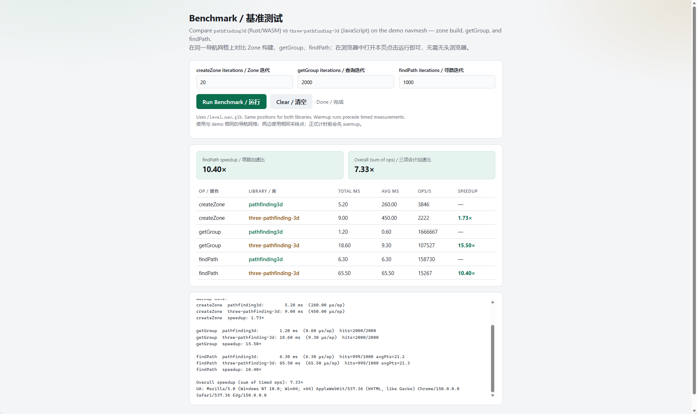

# pathfinding3d

[](https://www.npmjs.com/package/pathfinding3d)

[简体中文](README.zh-CN.md)

The fastest JavaScript 3D pathfinding library. Core algorithms are implemented in Rust and compiled to WebAssembly, delivering near-native 3D NavMesh performance in browsers and Node.js.

Not a Three.js-only plugin — any JavaScript 3D engine that can supply mesh vertex and index data can build zones, query groups, and find paths.

## Highlights

- Extreme performance: Rust + WebAssembly pathfinding, roughly **10x** faster than `three-pathfinding-3d` on `findPath`.
- Engine agnostic: works with Three.js, Babylon.js, PlayCanvas, Cesium, custom WebGL/WebGPU engines, and any JS 3D scene.
- Full NavMesh workflow: triangle mesh → zones → groups / nodes → A* → funnel-smoothed paths.
- Low JS overhead: results written into a preallocated `Float32Array`, reducing allocations and GC pressure.
- Ready for Web, Electron, Node.js, and other ESM environments via `wasm-pack`.



*Demo navmesh (`level.nav.glb`): `findPath` **10.4x**, overall **7.3x** vs `three-pathfinding-3d`. Reproduce with [`demo/benchmark.html`](../demo/benchmark.html).*

## Install

```bash
npm install pathfinding3d
# yarn add pathfinding3d
# pnpm add pathfinding3d
```

ESM-only (`"type": "module"`). TypeScript definitions are included.

```js
import { PathfindingWasm } from "pathfinding3d";

const pathfinding = new PathfindingWasm();
```

WASM initializes on first import — no separate `init()` call.

**Vite** — add WASM plugins:

```bash
npm install -D vite-plugin-wasm vite-plugin-top-level-await
```

```ts
// vite.config.ts
import { defineConfig } from "vite";
import wasm from "vite-plugin-wasm";
import topLevelAwait from "vite-plugin-top-level-await";

export default defineConfig({
  build: { target: "esnext" },
  plugins: [wasm(), topLevelAwait()],
});
```

**Webpack 5+** — enable the `asyncWebAssembly` experiment.

**Local / from source** — requires [Rust](https://rustup.rs/) and [wasm-pack](https://rustwasm.github.io/wasm-pack/):

```bash
cargo install wasm-pack
wasm-pack build --release
npm install ./pkg
```

## Quick Start

```js
import { PathfindingWasm } from "pathfinding3d";

const pathfinding = new PathfindingWasm();

// positions: Float32Array [x, y, z, ...]
// indices:   Uint32Array  [a, b, c, ...]
pathfinding.create_zone("level-1", positions, indices, 0.001);

const groupId = pathfinding.get_group("level-1", start.x, start.y, start.z, true);
if (groupId === undefined) return;

const output = new Float32Array(1024 * 3);
const pointCount = pathfinding.find_path(
  "level-1",
  groupId,
  start.x, start.y, start.z,
  target.x, target.y, target.z,
  output,
);

const path = [];
for (let i = 0; i < pointCount; i += 1) {
  path.push({
    x: output[i * 3],
    y: output[i * 3 + 1],
    z: output[i * 3 + 2],
  });
}
```

## API Overview

- `create_zone(zoneId, positions, indices, tolerance)` — build a zone from triangle mesh data.
- `create_zone_handle(positions, indices, tolerance)` — same, returns a numeric handle.
- `get_group(zoneId, x, y, z, checkPolygon)` — group containing or nearest to a position.
- `get_closest_node_id(zoneId, x, y, z, checkPolygon)` — closest node in that group.
- `find_path(zoneId, groupId, sx, sy, sz, tx, ty, tz, output)` — write path into a `Float32Array`.
- `group_count` / `group_node_count` / `group_node_ids` / `group_node_centers` — zone metadata.

See [CHANGELOG.md](../CHANGELOG.md) for breaking changes.

## Node IDs

Node IDs are **group-local** (`0` … `group_node_count(zoneId, groupId) - 1`), not global triangle indices.

| API | Meaning |
|-----|---------|
| `get_closest_node_id(zoneId, …)` | Closest triangle index in the group at the query point |
| `group_node_ids(zoneId, groupId)` | All triangle indices in that group |
| `node_center(zoneId, groupId, nodeId)` | Centroid of triangle `nodeId` in `groupId` |

Always pair a node ID with the `groupId` from `get_group` (or the one passed to `find_path`). Do not compare IDs across groups.

## License

[MIT](../LICENSE). Release notes: [CHANGELOG.md](../CHANGELOG.md).
